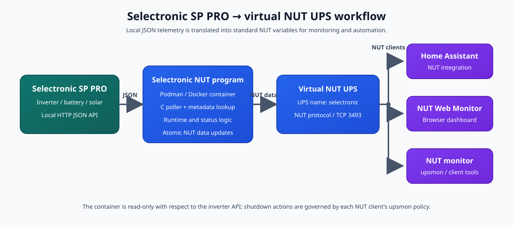

# Selectronic SP PRO to NUT

This project exposes a Selectronic SP PRO inverter as a virtual Network UPS
Tools (NUT) device. The program polls the inverter's local HTTP JSON API and
publishes the values through a NUT `dummy-ups` server in a Podman or Docker
container.

The virtual UPS can be consumed by NUT clients such as `upsmon`, NUT Monitor,
NUT Web Monitor, and Home Assistant.



## Features

- Polls the Selectronic local JSON API without cloud services.
- Publishes a standard NUT UPS named `selectronic`.
- Runs alongside another NUT server by using a separate host port.
- Reads serial number, inverter rating, and firmware from the device metadata.
- Reports battery state of charge, runtime estimate, load, real power, voltage,
  battery/grid/solar power, energy totals, and fault information.
- Provides configurable low-battery and shutdown thresholds.
- Includes a small C poller with Doxygen comments.
- Supports both Podman and Docker.

## Architecture

The container has two internal functions:

1. The startup script obtains device metadata and creates the NUT server
   configuration.
2. The poller repeatedly fetches the Selectronic point feed and writes the
   current values to a NUT `dummy-ups` definition.

NUT clients connect to the published container port. The inverter does not need
to know about NUT clients, Home Assistant, or the web monitor.

## Requirements

- A Selectronic SP PRO with its local web interface enabled.
- Network access from the container to the inverter.
- Podman or Docker.
- The inverter IP address.
- The Selectronic device ID.
- A host TCP port for the container's NUT server.

The device ID is the identifier in this API URL:

```text
http://INVERTER_IP/cgi-bin/solarmonweb/devices/DEVICE_ID
```

Check that the metadata endpoint responds before starting the container:

```sh
curl http://INVERTER_IP/cgi-bin/solarmonweb/devices/DEVICE_ID
curl http://INVERTER_IP/cgi-bin/solarmonweb/devices/DEVICE_ID/point
```

The metadata feed normally provides the serial number, inverter rating, and
firmware. The point feed provides live values and energy totals. Battery
capacity is not provided by these feeds and must be configured manually.

## Build the image

The build context is the `container` directory:

```sh
cd container
podman build -t selectronic-nut:latest -f Containerfile .
```

With Docker:

```sh
cd container
docker build -t selectronic-nut:latest -f Containerfile .
```

The image compiles the C poller and includes NUT server, libcurl, Jansson,
`curl`, and `jq`.

## Configuration variables

### Required

| Variable | Description |
|---|---|
| `SELECTRONIC_IP` | IP address or resolvable hostname of the inverter. |
| `SELECTRONIC_DEVICE_ID` | Device identifier used by the Selectronic API. |

### Recommended or optional

| Variable | Default | Description |
|---|---:|---|
| `NUT_USER` | `nutmon` | NUT account created by the container. |
| `NUT_PASSWORD` | `change-me` | NUT password. Always replace the default. |
| `SELECTRONIC_MODEL` | `SP PRO` | Model label. Firmware is appended automatically. |
| `SELECTRONIC_BATTERY_CAPACITY_KWH` | `0` | Usable battery capacity for runtime calculation. |
| `SELECTRONIC_BATTERY_VOLTAGE` | `0` | Nominal battery voltage reported to NUT. |
| `SELECTRONIC_AC_VOLTAGE` | `240` | Nominal input and output voltage reported to NUT. |
| `SELECTRONIC_SOLAR_CAPACITY_KW` | `0` | Solar capacity exposed as a custom NUT variable. |
| `SELECTRONIC_RUNTIME_EFFICIENCY` | `0.9` | Runtime efficiency multiplier from 0 to 1. |
| `SELECTRONIC_SHUTDOWN_PERCENT` | `10` | SOC threshold at or below which NUT reports `OB LB`. |
| `SELECTRONIC_LOW_BATTERY` | `20` | SOC threshold at or below which NUT reports `OL LB`. |
| `SELECTRONIC_AC_MODE` | `always_online` | Use `grid_w_nonzero` only when non-zero `grid_w` reliably means AC input is present. |
| `POLL_INTERVAL` | `5` | Seconds between point-feed polls. |

The inverter rating and serial number should not normally be passed as
variables: they are obtained from the metadata feed at container startup.
`SELECTRONIC_MODEL` is still useful when the API reports only a generic type
such as `SP-PRO` and an exact model label is desired.

## Run with Podman

Choose a host port that is not already used by another NUT server. The
container listens on port 3493 internally; this example publishes it as 3494.
Replace every placeholder with values for the installation.

```sh
podman run -d \
  --name selectronic-nut \
  --restart=unless-stopped \
  -p HOST_NUT_PORT:3493 \
  -e SELECTRONIC_IP=INVERTER_IP \
  -e SELECTRONIC_DEVICE_ID=DEVICE_ID \
  -e SELECTRONIC_MODEL='MODEL_LABEL' \
  -e SELECTRONIC_BATTERY_CAPACITY_KWH=BATTERY_CAPACITY \
  -e SELECTRONIC_BATTERY_VOLTAGE=BATTERY_VOLTAGE \
  -e SELECTRONIC_AC_VOLTAGE=AC_VOLTAGE \
  -e SELECTRONIC_SOLAR_CAPACITY_KW=SOLAR_CAPACITY \
  -e SELECTRONIC_SHUTDOWN_PERCENT=SHUTDOWN_PERCENT \
  -e NUT_USER=nutmon \
  -e NUT_PASSWORD='STRONG_PASSWORD' \
  selectronic-nut:latest
```

For a host publishing port 3494, clients connect to:

```text
selectronic@HOSTNAME_OR_IP:3494
```

Check the container and query NUT:

```sh
podman ps --filter name=selectronic-nut
podman logs -f selectronic-nut
upsc selectronic@HOSTNAME_OR_IP:3494
```

## Run with Docker

The Docker command is equivalent:

```sh
docker run -d \
  --name selectronic-nut \
  --restart unless-stopped \
  -p HOST_NUT_PORT:3493 \
  -e SELECTRONIC_IP=INVERTER_IP \
  -e SELECTRONIC_DEVICE_ID=DEVICE_ID \
  -e SELECTRONIC_MODEL='MODEL_LABEL' \
  -e SELECTRONIC_BATTERY_CAPACITY_KWH=BATTERY_CAPACITY \
  -e SELECTRONIC_BATTERY_VOLTAGE=BATTERY_VOLTAGE \
  -e SELECTRONIC_AC_VOLTAGE=AC_VOLTAGE \
  -e SELECTRONIC_SOLAR_CAPACITY_KW=SOLAR_CAPACITY \
  -e SELECTRONIC_SHUTDOWN_PERCENT=SHUTDOWN_PERCENT \
  -e NUT_USER=nutmon \
  -e NUT_PASSWORD='STRONG_PASSWORD' \
  selectronic-nut:latest
```

## Configure NUT Web Monitor

Add the published endpoint to the monitor's NUT hosts configuration:

```text
MONITOR selectronic@NUT_SERVER:HOST_NUT_PORT "Selectronic SP PRO"
```

For a monitor running on the same host as the container, use the host address
or `127.0.0.1` as appropriate for the monitor's network namespace. Reload or
restart the web monitor after changing its configuration.

The UPS name is `selectronic`; the container name is not part of the NUT UPS
name.

## Configure NUT Monitor or `upsmon`

NUT Monitor and other NUT clients need the published host and port. A standard
`upsmon.conf` entry is:

```ini
MONITOR selectronic@NUT_SERVER:HOST_NUT_PORT 1 nutmon STRONG_PASSWORD primary
```

Use the `secondary` role when that is appropriate for the site's NUT topology.
The username and password must match `NUT_USER` and `NUT_PASSWORD` in the
container.

`SELECTRONIC_SHUTDOWN_PERCENT` changes when the UPS reports `OB LB`; it does
not directly switch off the inverter. A client only shuts down when its own
`upsmon` policy and privileges allow it.

## Configure Home Assistant

Home Assistant can use its NUT integration to read the container's NUT server.
Add the NUT integration and provide:

- Host: the Docker/Podman host running the container
- Port: the published host NUT port
- UPS name: `selectronic`
- Username: the configured `NUT_USER`
- Password: the configured `NUT_PASSWORD`

If Home Assistant runs in another container, use a hostname or address that is
reachable from that container. Do not use `127.0.0.1` unless Home Assistant
and the NUT server share the same network namespace.

## NUT variables

Standard variables include:

- `ups.status`, `ups.load`, `ups.realpower`, and `ups.realpower.nominal`
- `input.voltage` and `output.voltage`
- `battery.charge`, `battery.runtime`, and `battery.voltage`
- `ups.serial`, `device.serial`, `ups.model`, and `device.model`

Selectronic-specific variables include:

- `selectronic.battery_w`
- `selectronic.grid_w`
- `selectronic.solar_w`
- `selectronic.solar_capacity_kw`
- battery, grid, load, and solar energy totals
- `selectronic.shunt_w`, `selectronic.gen_status`,
  `selectronic.fault_code`, `selectronic.fault_ts`, and
  `selectronic.timestamp`

Solar power is exposed as a NUT variable. Whether it appears as a separate
topology flow depends on the NUT web monitor in use.

## Runtime calculation

When battery capacity and demand are available, estimated runtime is:

```text
capacity_kwh × 1000 × state_of_charge / 100 × efficiency
----------------------------------------------------------------
                         demand_w
```

Positive battery discharge power is preferred as demand. Otherwise, AC load is
used. If capacity or demand is unavailable, the service reports a one-hour
fallback runtime.

## Running alongside another NUT server

The container's internal port is 3493. If a host NUT server already uses 3493,
publish the container on another port:

```sh
-p 3494:3493
```

Keep the existing UPS configuration on the host and point clients to the
appropriate port for each UPS. Do not add the Selectronic UPS to the host's
native `ups.conf` when using this container.

## Upgrading

Build the new image and recreate the container with the same environment
variables:

```sh
podman build -t selectronic-nut:latest -f container/Containerfile container/
podman rm -f selectronic-nut
# Re-run the documented podman run command.
upsc selectronic@HOSTNAME_OR_IP:HOST_NUT_PORT
```

For Docker, replace `podman` with `docker`.

## Troubleshooting

### The container exits immediately

Inspect the logs:

```sh
podman logs selectronic-nut
```

Common causes are an incorrect IP, incorrect device ID, blocked network access,
or a device whose metadata endpoint is unavailable.

### `upsc` reports `Unknown UPS`

Verify that the container is running, the host port is correct, and the UPS
name is exactly `selectronic`:

```sh
upsc selectronic@NUT_SERVER:HOST_NUT_PORT
```

### Values are stale

Check the container logs and test both API endpoints from the container's
network. The last valid NUT definition is retained when a later poll fails.

### Runtime is inaccurate

Verify that `SELECTRONIC_BATTERY_CAPACITY_KWH` represents usable battery energy,
not merely nominal nameplate capacity. Also verify load, battery voltage, and
`SELECTRONIC_RUNTIME_EFFICIENCY`.

### Another NUT server already uses port 3493

Publish this container on a different host port and use that port in every NUT
client, Home Assistant configuration, and web monitor entry.

## Project files

| File | Purpose |
|---|---|
| `container/Containerfile` | Builds the image and compiles the poller. |
| `container/entrypoint.sh` | Fetches metadata and starts the NUT server. |
| `container/selectronic-nut-poller.c` | Polls the Selectronic API and writes NUT values. |
| `container/README.md` | Container-specific reference documentation. |

## License and contributions

Contributions should preserve the documented environment-variable interface and
validate changes with a clean image build and an `upsc` query against a test
device or fixture. Do not commit private IP addresses, device IDs, serial
numbers, passwords, or site-specific battery values.
